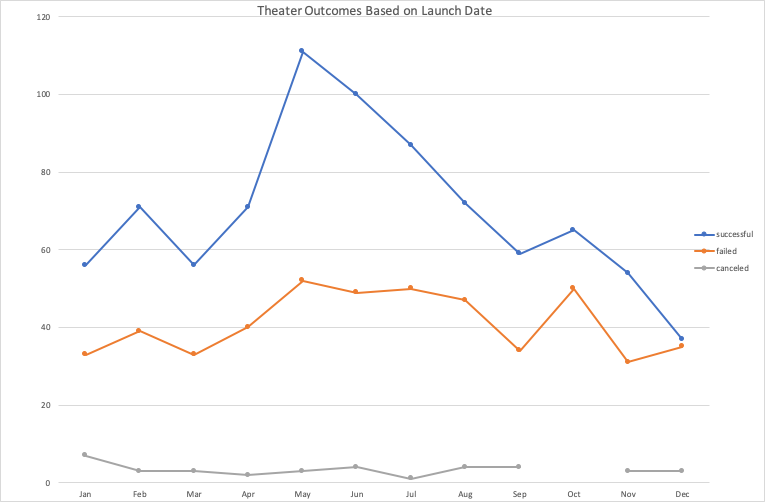
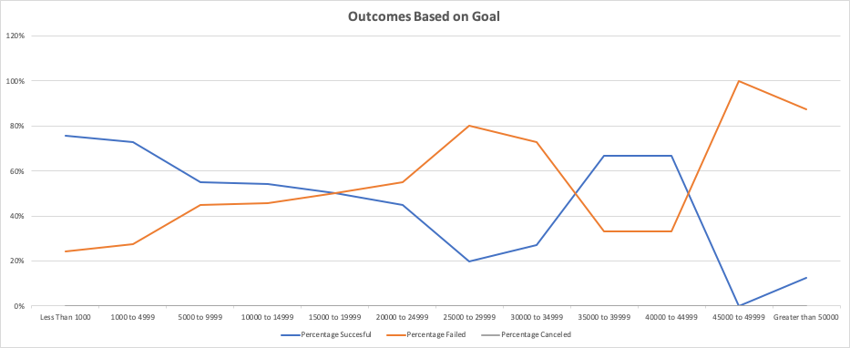

# Kickstarting with Excel

## Overview of Project
Louise is raising money for a fundrasisng for her play *Fever*. By using fundraising data from previous campaigns to analyse the success of other campaigns and to see if they reached their fundraising goal or not. Data includes data from around the world and various categories of entertainment. 

### Purpose
The purpose of this analysis is to visualize the outcomes of capaigns based on the dates they were launched and based on how much their fundraising goals were.

## Analysis and Challenges
I ran two different overall analysis to get graphs that visualize the outcomes based on launch date and outcomes based on fundraising goals. 

### Analysis of Outcomes Based on Launch Date
For the analysis of Outcomes based on Launch Date I deployed a pivot table in order to get a quick glance of how many theater plays were succesful in meeting their goal or if they failed or canceled. The rows for the pivot table is grouped by months to see which months had the most success when it came to fundraising and which months were the worst for fundraising. With this pivot table data I then ran a line graph to visualize the findings.

### Analysis of Outcomes Based on Goals
For the analysis of Outcomes based on Goals we looked at the number of plays succeeded in their fundraising goal, number of plays that failed, and the number of plays that were canceled. I used the countifs() function to get the total number for each column based on the criteria of fitting into the goal fundraising brackets, outcome, and, percentage of successfful, failed, and canceled projects for each row. I also generated a line graph to visualize the findings from the analysis.

### Challenges and Difficulties Encountered
For this analysis I did not run into any major problems. I did have to play around with Excel's syntax to get the right calculations for some of the formulas but nothing a little trial and error couldn't fix.
## Results

- What are two conclusions you can draw about the Outcomes based on Launch Date?
The first conclusion that I can draw from Outcomes based on Launch Date is that May and June are the general months where more campaigns meet their goal and should be the time where Louise should plan hers around.

The second conclusion is that December seems to be the worst month to try to plan the fundraising campaign for since it has the lowest success and one of the higher failed percentage. 

- What can you conclude about the Outcomes based on Goals?
A conclusion I made from the outcomes based on goals is that for the plays category a fundraising goal over $45,000 has a higher chance of failing and a much lower percentage of success and that goals under $5000 have higher success percentages. 

- What are some limitations of this dataset?
Some limitations of this dataset is that the time period is only a few years and range from 2014 to 2017. Excel's computing capabilities also has a limitations so after a certain number of data points Excel's computations wouldn't be efficient enough. Another limitation is some individuals might not report a failed fundraising attempt because of pride or emotions.

- What are some other possible tables and/or graphs that we could create?
Some possible tables that we could create for this data set could be graphing success rates based on countries. This could be to compare the US success rate over UK based on Parent category filters or subcategory filters. Another could be a graph with a total number of money collected per succesful campaigns per month to get another view at which months are the most lucrative. 
